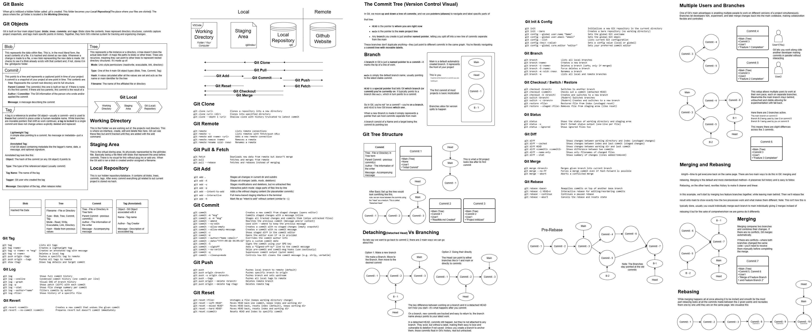

# 🧠 Git Diagram Breakdown

This repo holds a detailed visual reference for understanding Git from the inside out—ideal for visual learners or anyone building a strong mental model of how Git actually works.

## 🔍 Overview

The core diagram includes:

- Git Object Internals (Blobs, Trees, Commits, Tags)
- Local vs Remote Layout (Working Directory → Staging Area → Local Repo → Remote)
- Core Commands (Add, Commit, Push, Pull, Fetch, Status, Log, Diff, etc.)
- Branching, Checkout, and Detached HEAD
- Merging vs Rebasing (with example flows)
- Multi-user scenarios and feature branching
- Commit Trees and History Visualization

## 📂 Files

- `gitDiagram.drawio` – Editable source (open in diagrams.net / draw.io)
- `gitDiagram.drawio.png` – Exported diagram for quick viewing

## 🖼 Preview

## 🛠 How to Use

To edit:
- Open `gitDiagram.drawio` file in [draw.io](https://app.diagrams.net/)

To view:
- Open `gitDiagram.drawio.png` in your browser or viewer

## 💬 Why This Exists

This started as a personal effort to demystify Git—especially branching and history rewriting. Feel free to fork, remix, or contribute if you're also trying to "get Git" on a deeper level.

## 📣 Feedback Welcome

If you spot typos, missed concepts, or have suggestions to make it more useful—open an issue or pull request!
